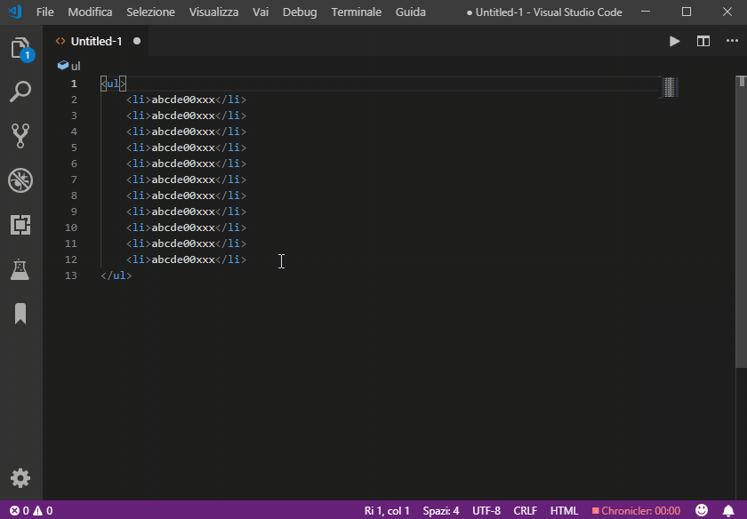

# vscode-progressive-increment-decrement

Fork of narsenico's [VSCode Progressive Increment](https://github.com/narsenico/vscode-progressive-increment) that allows for decrementing.

[](https://github.com/narsenico/vscode-progressive-increment/blob/master/LICENSE)

Increments or decrememnts progressively integer values found in selection(s) by 1 or 10.



## Commands:
- Progressive: increment by 1
- Progressive: increment by 10
- Progressive: increment by ...
- Progressive: decrement by 1
- Progressive: decrement by 10
- Progressive: decrement by ...

## Settings:
- ```progressive.allowZeroLengthSelection```:
if true increments or decrememnts the number before or after the cursor in case of zero length selection (default **false**).

## Shortcuts:

### Win\Linux:
- Increment by 1:  <kbd>ctrl</kbd> + <kbd>alt</kbd> + <kbd>i</kbd>
- Increment by 10: <kbd>ctrl</kbd> + <kbd>alt</kbd> + <kbd>shift</kbd> + <kbd>i</kbd>
- Increment by 1:  <kbd>ctrl</kbd> + <kbd>alt</kbd> + <kbd>d</kbd>
- Increment by 10: <kbd>ctrl</kbd> + <kbd>alt</kbd> + <kbd>shift</kbd> + <kbd>d</kbd>

### Mac:
- Increment by 1:  <kbd>cmd</kbd> + <kbd>alt</kbd> + <kbd>i</kbd>
- Increment by 10: <kbd>cmd</kbd> + <kbd>alt</kbd> + <kbd>shift</kbd> + <kbd>i</kbd>
- Increment by 1:  <kbd>cmd</kbd> + <kbd>alt</kbd> + <kbd>d</kbd>
- Increment by 10: <kbd>cmd</kbd> + <kbd>alt</kbd> + <kbd>shift</kbd> + <kbd>d</kbd>
